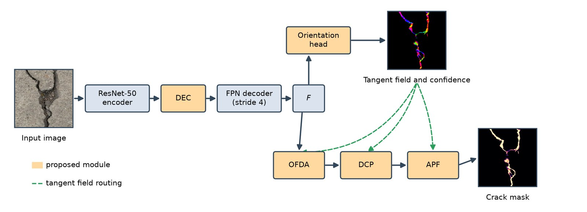

<div align="center">

# OCPNet

---

### OCPNet: Orientation Guided Aggregation and Connectivity Propagation for Thin Crack Segmentation and Geometric Quantification

<a href="https://twakjira.github.io/OCPNet/" target="_blank" rel="noopener noreferrer"></a>
<a href="#" target="_blank" rel="noopener noreferrer"></a>
<a href="#data"></a>

<a href="https://www.ai4riselab.com" target="_blank" rel="noopener noreferrer">Tadesse G. Wakjira</a>, <a href="https://hanagoshu.com" target="_blank" rel="noopener noreferrer">Hana L. Goshu</a>

*Under Review*

</div>

---

## Overview

An interruption in a predicted mask biases estimates of crack length and width even when
region overlap remains high. OCPNet therefore learns a supervised crack tangent field and
uses it to steer deformable feature aggregation and connectivity propagation along the
local crack direction. The orientation target comes from the structure tensor of the
annotated mask, so no additional labelling is required.

<div align="center">

</div>

On DeepCrack, OCPNet reaches the highest value of every segmentation metric and reduces
the deviation of the fragmentation ratio from 0.457 to 0.050. Transferred without
adaptation, it improves the centerline Dice by 10.75 points on CFD and 17.16 points on
GAPs384.

Predictions can be explored on the
<a href="https://twakjira.github.io/OCPNet/" target="_blank" rel="noopener noreferrer">project page</a>.

## Status

Under review. Source code, training configurations and trained checkpoints will be
released upon paper acceptance.

## Architectural contributions

| | Element |
|---|---|
| M1 | Directional elongated context, from horizontal and vertical strip convolutions at several dilation rates |
| M2 | Supervised orientation head predicting a double angle tangent vector and a crack confidence |
| M3 | Deformable aggregation at signed offsets along the local tangent, returned as a residual scaled by the crack confidence |
| M4 | Connectivity propagation over two recurrent steps, gated by the crack confidence |
| M5 | Adaptive fusion, whose pixelwise gate keeps the connectivity pathway from reducing pixel precision |
| M6 | Geometric quantification of centerline length, mean width, component count, completeness and correctness |

## Results

| Model | ODS | F1 | IoU | mIoU | clDice |
|---|---|---|---|---|---|
| U-Net | 85.33 | 83.97 | 72.38 | 85.53 | 86.81 |
| DeepLabV3+ | 85.88 | 84.51 | 73.18 | 85.94 | 88.16 |
| FPN | 85.32 | 83.84 | 72.18 | 85.42 | 87.34 |
| PSPNet | 81.84 | 80.41 | 67.25 | 82.82 | 82.43 |
| SegFormer-R50 | 84.45 | 82.48 | 70.19 | 84.38 | 86.27 |
| **OCPNet** | **86.59** | **85.85** | **75.21** | **87.00** | **90.24** |

DeepCrack test split. Paired Wilcoxon signed rank tests give p < 0.05 for IoU and clDice
against every baseline.

## Data

| Source | Use |
|---|---|
| <a href="https://github.com/yhlleo/DeepCrack" target="_blank" rel="noopener noreferrer">DeepCrack</a> | Training and within dataset testing |
| <a href="https://github.com/cuilimeng/CrackForest-dataset" target="_blank" rel="noopener noreferrer">CFD (Crack Forest Dataset)</a> | Cross dataset testing |
| <a href="https://www.tu-ilmenau.de/neurob/data-sets-code/gaps/" target="_blank" rel="noopener noreferrer">GAPs384</a> | Cross dataset testing |

## Citation

```
@article{wakjira2026ocpnet,
    title   = {OCPNet: Orientation guided aggregation and connectivity propagation
               for thin crack segmentation and geometric quantification},
    author  = {Wakjira, Tadesse G. and Goshu, Hana L.},
    journal = {Under Review},
    year    = {2026}
}
```

## Authors

<strong><a href="https://www.ai4riselab.com" target="_blank" rel="noopener noreferrer">Tadesse G. Wakjira</a></strong>, AI4RISE Lab

<strong><a href="https://hanagoshu.com" target="_blank" rel="noopener noreferrer">Hana L. Goshu</a></strong> (<a href="https://github.com/HanaLebeta" target="_blank" rel="noopener noreferrer">@HanaLebeta</a>), Department of Electrical and Electronic Engineering, The Hong Kong Polytechnic University

## Development

Developed by <a href="https://www.ai4riselab.com" target="_blank" rel="noopener noreferrer">AI4RISE Lab</a>
